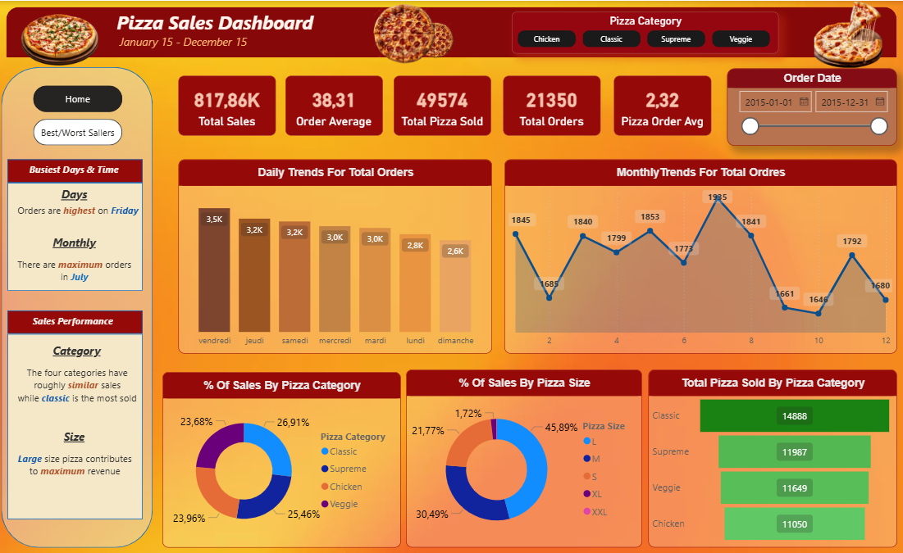
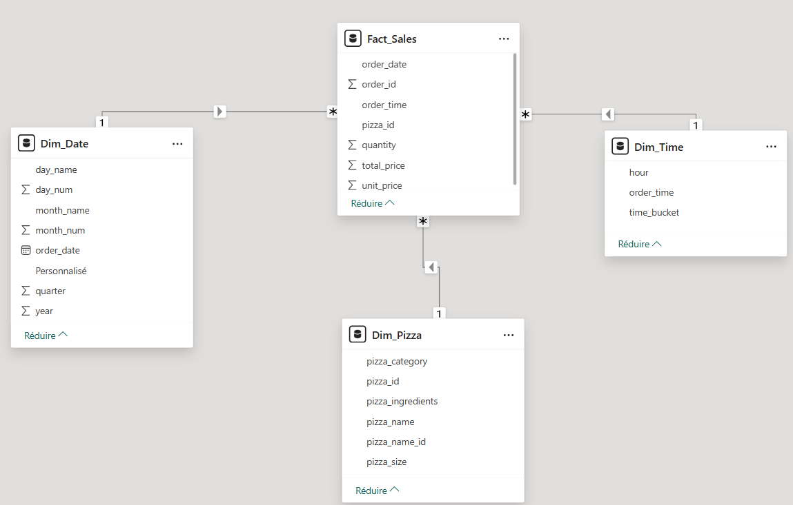
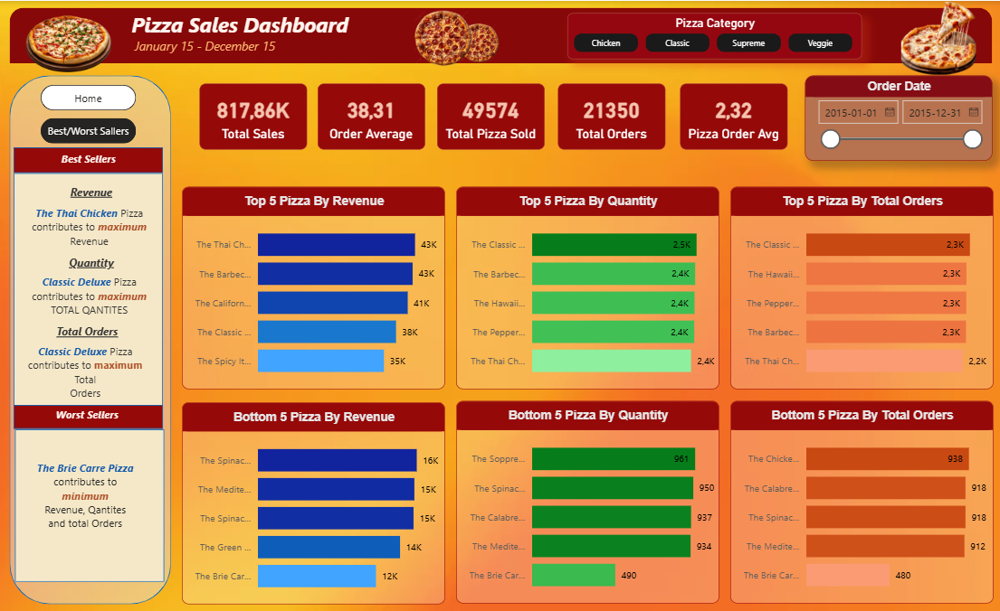

# 🍕 Pizza Sales Dashboard — Power BI

> Tableau de bord interactif pour analyser les ventes et la performance produit d'une chaîne de pizzerias.



---

## 📌 Contexte

Une chaîne de pizzerias souhaitait analyser ses ventes afin d'optimiser ses opérations, suivre les tendances clients et faciliter la prise de décision stratégique.

**Dataset :** 84 600 lignes × 12 colonnes — `pizza_sales.csv`  
**Période analysée :** Janvier 2015 – Décembre 2015  
**Outil principal :** Power BI Desktop (Power Query + Data Modeling + DAX )

---

## 🎯 Objectifs

- Nettoyer et transformer les données brutes via **Power Query**
- Construire un **modèle en étoile** avec relations entre tables
- Créer des **mesures DAX** clés pour suivre les KPIs
- Développer un **dashboard interactif** avec filtres et navigation

---

## 🗂️ Structure du repo

```
pizza-sales-dashboard/
│
├── data/
│   └── pizza_sales.csv          # Dataset source (48 620 lignes)
│
├── screenshots/
│   ├── dashboard_home.png       # Page principale — KPIs & tendances
│   ├── dashboard_sellers.png    # Page Best/Worst Sellers
│   └── data_model.png           # Modèle en étoile
│
├── Pizza_Sales_Dashboard.pbix   # Fichier Power BI
└── README.md
```

---

## 🔄 Préparation des données — Power Query

4 tables construites à partir du fichier source :

### `Fact_Sales`
- Suppression des colonnes non nécessaires
- Fractionnement de `order_date` (format texte) → reconstruction en type `date`
- Remplacement du séparateur décimal `.` → `,` pour `unit_price` et `total_price`
- Typage correct de toutes les colonnes

### `Dim_Pizza`
- Extraction des colonnes descriptives : `pizza_id`, `pizza_name`, `pizza_name_id`, `pizza_size`, `pizza_category`, `pizza_ingredients`
- Suppression des doublons

### `Dim_Date`
- Colonnes calculées : `year`, `month_num`, `month_name`, `day_num`, `day_name`, `quarter`
- Colonne personnalisée : `Jour ouvrable` / `Week-end`

### `Dim_Time`
- Extraction de l'heure depuis `order_time`
- Colonne `time_bucket` : Matin (6h–12h) / Après-midi (12h–18h) / Nuit

---

## ⭐ Modèle de données

Modélisation en **étoile** — `Fact_Sales` au centre reliée aux 3 dimensions :

```
Dim_Date  ──(1)──▶ Fact_Sales ◀──(1)── Dim_Time
                       │
                      (1)
                       ▼
                   Dim_Pizza
```



---

## 📐 Mesures DAX principales

| Mesure | Description |
|---|---|
| `Total Sales` | Somme du chiffre d'affaires total |
| `Total Orders` | Nombre distinct de commandes |
| `Total Pizza Sold` | Quantité totale de pizzas vendues |
| `Order Average` | Valeur moyenne par commande |
| `Pizza Order Avg` | Nombre moyen de pizzas par commande |
| `Top 5 By Revenue` | Top 5 pizzas par CA (RANKX) |
| `Bottom 5 By Revenue` | Bottom 5 pizzas par CA |
| `% Contribution` | Part de chaque catégorie / taille dans le CA total |

---

## 📊 Dashboard

### Page 1 — Home


**KPIs globaux :**
- 💰 Total Sales : **817,86K**
- 🛒 Total Orders : **21 350**
- 🍕 Total Pizza Sold : **49 574**
- 📦 Order Average : **38,31**
- 🔢 Pizza Order Avg : **2,32**

**Visualisations :**
- Tendances journalières des commandes (bar chart)
- Tendances mensuelles (line chart)
- Répartition des ventes par catégorie (donut chart)
- Répartition par taille de pizza (donut chart)
- Total vendu par catégorie (bar chart horizontal)

**Insights clés :**
- 📅 Le **vendredi** est le jour le plus chargé
- 📆 **Juillet** est le mois de pointe
- 🏆 La catégorie **Classic** est la plus vendue
- 📏 La taille **Large** génère le maximum de revenus

---

### Page 2 — Best / Worst Sellers



- **Top 5** et **Bottom 5** par : Revenus · Quantité · Total Commandes
- 🥇 Meilleur en revenus : **The Thai Chicken Pizza** (43K)
- 🥇 Meilleur en quantité : **Classic Deluxe Pizza** (2,5K)
- ⚠️ Moins performant : **The Brie Carre Pizza** (12K revenus / 490 quantité)

---

## 🔧 Stack technique


---

## 🚀 Comment utiliser ce projet

1. Clone le repo :
   ```bash
   git clone https://github.com/TON_USERNAME/pizza-sales-dashboard.git
   ```
2. Ouvre `Pizza_Sales_Dashboard.pbix` avec **Power BI Desktop**
3. Si nécessaire, redirige la source de données vers `data/pizza_sales.csv`  
   *(Accueil → Transformer les données → Source → modifier le chemin)*

---

## 👤 Auteur

**Asmae Janah** — Data Analyst
[](www.linkedin.com/in/asmae-janah-6222572a3)
[](https://github.com/JanahAsmae)
